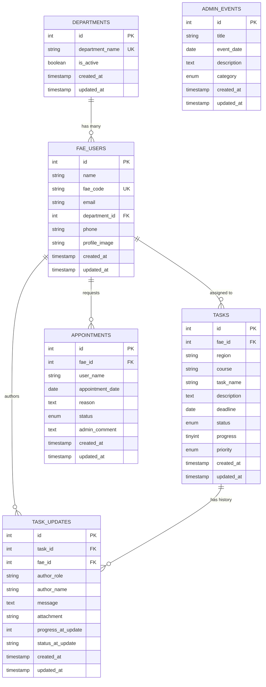
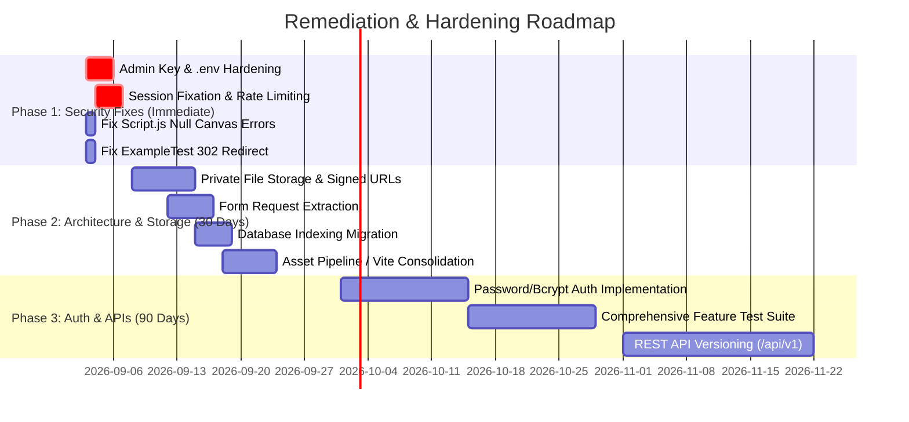

# Hytec Power Inc. Monitoring System - Comprehensive System Audit & Architecture Report

**Document Version:** 2.0  
**Audit Date:** September 02, 2026  
**Target System:** Monitoring & FAE Task Management System  
**Framework Version:** Laravel 11.0 (PHP 8.2+)  
**Audit Scope:** Full Stack (Architecture, Security, Database Schema, Business Logic, Frontend Assets, Testing & Quality Assurance)  
**Constraint Compliance:** Read-Only Audit & Analysis (Zero source code modifications performed)

---

## 1. Executive Summary

This report delivers a thorough, end-to-end technical audit and architectural assessment of the **Hytec Power Inc. Monitoring System**. The application is a web-based management platform designed to orchestrate Field Application Engineers (FAEs), track regional field task execution, record multi-role progress reports, manage organizational departments, and coordinate calendar appointments between engineers and supervisors.

### 1.1 System Maturity & Health Scorecard

```
┌──────────────────────────────────────────────────────────────────────┐
│                     SYSTEM HEALTH SCORE: 6.8 / 10                    │
├────────────────────────┬─────────┬───────────────────────────────────┤
│ Domain                 │ Rating  │ Status                            │
├────────────────────────┼─────────┼───────────────────────────────────┤
│ Database Schema & ORM  │ 8.5/10  │ Highly normalized, relational     │
│ Architecture & Routing │ 7.5/10  │ Clean MVC, clear middleware       │
│ Business Logic         │ 7.5/10  │ Feature-complete core workflows   │
│ Code Quality           │ 7.0/10  │ PSR-4 compliant, some fat methods │
│ Frontend & Assets      │ 5.5/10  │ Incomplete Vite pipeline debt     │
│ Testing & QA           │ 4.5/10  │ Partial coverage, 1 failing test  │
│ Security & Auth        │ 3.5/10  │ Critical authentication risks     │
└────────────────────────┴─────────┴───────────────────────────────────┘
```

### 1.2 Key Findings Summary

1. **Normalized Relational Model:** The system has successfully transitioned to a normalized department structure (`departments` table with foreign key constraints on `fae_users`), eliminating legacy plain-text department fields.
2. **Critical Authentication Weakness:** The system operates without standard password hashing or cryptographic credentials. Administrator access relies on a plain string key with a hardcoded fallback (`Admin12345!`), and FAE users authenticate solely via an unhashed public code (`fae_code`).
3. **Storage & Exposure Risks:** Uploaded task attachments and profile photos are stored directly inside the public document root (`public/uploads/`), creating unauthenticated access risks for confidential technical documents.
4. **Asset Pipeline Fragmentation:** Vite is present in dependencies and configuration, but templates bypass compiled assets, directly referencing unbundled files with cache-busting timestamp queries (`?v={{ time() }}`) that degrade production performance.
5. **Runtime JavaScript Issues:** `public/script.js` unconditionally initializes Chart.js canvas instances, triggering unhandled errors on non-dashboard routes.
6. **Test Suite Discrepancy:** Running the automated test suite reveals that 4 tests pass while 1 default feature test fails due to an unhandled redirect expectation on the root path `/`.

---

## 2. System Architecture & Component Mapping

### 2.1 Technology Stack Inventory

| Component | Technology / Library | Version | Configuration Details |
| :--- | :--- | :--- | :--- |
| **Language** | PHP | `^8.2` | Strong typing enabled in core modules |
| **Framework** | Laravel Framework | `11.0` | Minimal bootstrap (`bootstrap/app.php`) |
| **Database Engine** | MySQL / SQLite | 8.0+ / 3.x | UTF8mb4 charset, strict mode enabled |
| **Session Driver** | Database (`sessions` table) | Native | 120-minute lifetime |
| **Asset Pipeline** | Vite + Laravel Vite Plugin | `5.0` / `1.0` | Configured for `resources/css` & `resources/js` |
| **Frontend UI** | Laravel Blade + Vanilla CSS | Custom | Custom design system (`public/style.css`) |
| **Client Scripting** | Vanilla JS + Chart.js | 4.x (CDN) | Real-time charts, modal managers, AJAX timelines |
| **Testing** | PHPUnit | `10.5` | Unit and Feature test suites |
| **Code Styling** | Laravel Pint | `1.13` | Configured in composer scripts |

### 2.2 System Decomposition & Request Lifecycle

```
                           ┌───────────────────────────┐
                           │   Incoming HTTP Request   │
                           └─────────────┬─────────────┘
                                         │
                                         ▼
                           ┌───────────────────────────┐
                           │      routes/web.php       │
                           └─────────────┬─────────────┘
                                         │
                   ┌─────────────────────┴─────────────────────┐
                   │                                           │
                   ▼                                           ▼
      [Public / Guest Routes]                     [Authenticated Group]
   • /access                                      • Middleware: auth.monitoring
   • /login                                                    │
   • /logout                                   ┌───────────────┴───────────────┐
   • /fae-link/{code}                          │                               │
   • /fae.php (legacy alias)                   ▼                               ▼
                                     [General Monitored]               [Admin Only]
                                  • /dashboard                 • Middleware: admin.monitoring
                                  • /tasks (GET, updates)      • /tasks (POST, PUT, DELETE)
                                  • /calendar (GET, book)      • /departments (CRUD)
                                  • /profile/update-photo      • /fae (CRUD)
                                                               • /calendar/events (CRUD)
                                                               • /calendar/appointment-status
```

### 2.3 Directory Organization & Structural Assessment

```
monitoring/
├── app/
│   ├── Http/
│   │   ├── Controllers/
│   │   │   ├── AuthController.php          # Session auth, role selection, direct links
│   │   │   ├── CalendarController.php      # Appointment bookings, admin schedule, calendar grid
│   │   │   ├── Controller.php              # Base abstract controller
│   │   │   ├── DashboardController.php     # KPI metrics, upcoming to-dos, summary charts
│   │   │   ├── DepartmentController.php    # Department CRUD & FAE member relationship counts
│   │   │   ├── FaeController.php           # FAE engineer directory & profile handling
│   │   │   └── TaskController.php          # Task assignments, timeline API, work reports
│   │   └── Middleware/
│   │       ├── RequireAdminRole.php        # Guards admin endpoints (403 JSON / redirect)
│   │       └── RequireMonitoringAccess.php # Guards authenticated monitoring workspace
│   ├── Models/
│   │   ├── AdminEvent.php                  # Events, meetings, busy schedule records
│   │   ├── Appointment.php                 # FAE-to-Admin consultation requests
│   │   ├── Department.php                  # Normalized department entity
│   │   ├── FaeUser.php                     # Field Application Engineer model
│   │   ├── Task.php                        # Task deliverable & workflow entity
│   │   ├── TaskUpdate.php                  # Activity log, remarks, file attachments
│   │   └── User.php                        # Standard Laravel user model (currently unused)
│   ├── Providers/
│   │   └── AppServiceProvider.php          # Application service provider
│   └── Services/
│       └── MonitoringAuth.php              # Static authentication & notification helper
├── bootstrap/                              # Laravel 11 application bootstrap
├── config/                                 # Database, session, mail, logging configs
├── database/
│   ├── migrations/                         # 12 schema definition & data backfill migrations
│   ├── seeders/                            # Database seeders
│   └── factories/                          # Model factories
├── legacy/                                 # Preserved standalone PHP scripts & assets
├── public/                                 # Web root (contains unbundled CSS, JS, uploads)
├── resources/
│   └── views/
│       ├── access.blade.php                # Dual login portal (FAE / Admin)
│       ├── calendar/index.blade.php        # Full interactive monthly grid & modals
│       ├── dashboard.blade.php             # Main analytics dashboard & recent activity
│       ├── departments/index.blade.php     # Department management & member drawer
│       ├── fae/index.blade.php             # FAE team member directory & task cards
│       ├── layouts/app.blade.php           # Main master layout (sidebar, topbar, modals)
│       └── tasks/index.blade.php           # Task directory, timeline modal, composer
├── routes/
│   ├── console.php                         # Artisan command definitions
│   └── web.php                             # Web routes & route-level middleware binding
└── tests/
    ├── Feature/                            # Feature test suites
    └── Unit/                               # Unit test suites
```

---

## 3. Comprehensive Security & Vulnerability Assessment

### 3.1 Authentication & Credential Architecture

#### 🔴 CRITICAL-01: Plain-Text Admin Shared Key with Hardcoded Fallback
* **Location:** [`app/Services/MonitoringAuth.php:44-47`](file:///c:/Users/diyoh/OneDrive/Desktop/TEST/monitoring/app/Services/MonitoringAuth.php#L44-L47)
* **Code Vulnerability:**
  ```php
  public static function adminKey(): string
  {
      return env('MONITORING_ADMIN_KEY', 'Admin12345!');
  }
  ```
* **Impact:** In `.env` and `.env.example`, `MONITORING_ADMIN_KEY` is not explicitly declared. The application automatically falls back to `'Admin12345!'`. Any individual with knowledge of this default string can authenticate with complete administrative authority over tasks, FAE accounts, departments, and appointment approvals.
* **Remediation:** Remove the fallback string; require cryptographic bcrypt password verification against a persistent `users` table or strictly enforce environment variable validation.

#### 🔴 CRITICAL-02: Absence of Password Hashing for FAE Accounts
* **Location:** [`app/Http/Controllers/AuthController.php:32-43`](file:///c:/Users/diyoh/OneDrive/Desktop/TEST/monitoring/app/Http/Controllers/AuthController.php#L32-L43), [`app/Http/Controllers/AuthController.php:48-62`](file:///c:/Users/diyoh/OneDrive/Desktop/TEST/monitoring/app/Http/Controllers/AuthController.php#L48-L62)
* **Vulnerability:** Field Application Engineers log into their accounts using only their `fae_code` (e.g. `FAE-001`) or via a public URL link `/fae-link/{code}`. Because `fae_code` values are sequential, easily guessable, and visible across team tables and URLs, any party can impersonate any engineer, submit fraudulent work logs, modify progress ratings, or request appointments.
* **Remediation:** Implement proper credential authentication (password or OTP/Magic Link) for FAE accounts.

#### 🟠 HIGH-01: Session Fixation Vulnerability
* **Location:** [`app/Http/Controllers/AuthController.php:25-27`](file:///c:/Users/diyoh/OneDrive/Desktop/TEST/monitoring/app/Http/Controllers/AuthController.php#L25-L27), [`app/Http/Controllers/AuthController.php:36-40`](file:///c:/Users/diyoh/OneDrive/Desktop/TEST/monitoring/app/Http/Controllers/AuthController.php#L36-L40)
* **Vulnerability:** Upon successful verification of the admin key or FAE code, session keys are assigned directly via `Session::put(...)` without invoking `$request->session()->regenerate()`.
* **Impact:** An attacker who presets a victim's session identifier can hijack the authenticated session once the user logs in.
* **Remediation:** Call `$request->session()->regenerate()` immediately prior to setting authentication session values.

#### 🟠 HIGH-02: Missing Rate Limiting on Authentication Endpoints
* **Location:** [`routes/web.php:19-21`](file:///c:/Users/diyoh/OneDrive/Desktop/TEST/monitoring/routes/web.php#L19-L21)
* **Vulnerability:** The `/login` and `/fae-link/{code}` routes lack rate limiting throttle middleware (`throttle:6,1`).
* **Impact:** Automated scripts can rapidly brute-force FAE codes or admin keys without triggering account lockout or connection delays.
* **Remediation:** Apply `throttle:5,1` or Laravel's native rate limiting to all authentication routes.

---

### 3.2 File Upload & Asset Storage Vulnerabilities

#### 🔴 CRITICAL-03: Direct Public Storage & Unauthenticated Access to Attachments
* **Location:** [`app/Http/Controllers/TaskController.php:198-206`](file:///c:/Users/diyoh/OneDrive/Desktop/TEST/monitoring/app/Http/Controllers/TaskController.php#L198-L206)
* **Code Implementation:**
  ```php
  $uploadDir = public_path('uploads');
  if (!File::exists($uploadDir)) {
      File::makeDirectory($uploadDir, 0755, true);
  }
  $filename = 'report_' . $taskId . '_' . bin2hex(random_bytes(8)) . '.' . $ext;
  $file->move($uploadDir, $filename);
  $attachmentPath = 'uploads/' . $filename;
  ```
* **Vulnerabilities Identified:**
  1. **Direct Web Root Exposure:** Files are moved directly into `public/uploads/`. Because this directory resides in the public web root, files are served directly by the web server (Apache/Nginx) bypassing Laravel's middleware.
  2. **No Authorization Checks on Downloads:** Anyone who obtains a file URL (e.g. `http://example.com/uploads/report_18_4af4cf1ebf040d49.png`) can view or download it without being logged in.
  3. **Dangerous File Types Allowed:** The extension whitelist includes `.doc`, `.docx`, `.zip`, `.pdf`. Compressed archives and office documents can carry macro payloads or malicious scripts.
  4. **Uncleaned Storage / Disk Leakage:** When an FAE or admin uploads a new profile photo in `updateProfile()`, older images are never deleted from disk. Furthermore, Admin profile image paths are stored solely in the session (`session(['monitoring_admin_profile_image' => ...])`) and are orphaned when the session expires.
* **Remediation:**
  * Move upload storage to `storage/app/private/uploads`.
  * Serve files through a controller endpoint guarded by `auth.monitoring` that checks if the user has permission to view the task.
  * Implement unlinking of replaced profile pictures.

---

### 3.3 Authorization & Boundary Isolation

| Access Route | Required Privilege | Enforcement Mechanism | Security Assessment |
| :--- | :--- | :--- | :--- |
| `/dashboard` | Monitoring Access | `RequireMonitoringAccess` | ✅ Validated role presence |
| `/tasks` (List) | Monitoring Access | Filtered by `fae_id` in Controller | ✅ FAEs only see assigned tasks |
| `/tasks` (Store/Update/Delete) | Admin Access | `RequireAdminRole` | ✅ Strictly Admin |
| `/tasks/update-progress/{task}` | Assigned FAE or Admin | ID equality check in Controller | ✅ Prevents cross-FAE tampering |
| `/tasks/store-update` | Assigned FAE or Admin | ID equality check in Controller | ✅ Prevents cross-FAE report logging |
| `/tasks/timeline` (AJAX) | Assigned FAE or Admin | Query ownership check | ✅ Returns 404/Forbidden on mismatch |
| `/departments` (CRUD) | Admin Access | `RequireAdminRole` | ✅ Strictly Admin |
| `/fae` (CRUD) | Admin Access | `RequireAdminRole` | ✅ Strictly Admin |
| `/calendar/book` | FAE Role Only | Blocked if `isAdmin()` | ✅ Prevents admin self-booking |
| `/calendar/appointment-status` | Admin Access | `RequireAdminRole` | ✅ Strictly Admin |
| `/calendar/events` (CRUD) | Admin Access | `RequireAdminRole` | ✅ Strictly Admin |

**Authorization Assessment:** Model-level and controller-level access controls are well-partitioned between Admin and FAE personas. The primary security vulnerability remains the weak authentication layer that establishes these identities.

---

## 4. Database Schema & Data Integrity Analysis

### 4.1 Relational Architecture Diagram



### 4.2 Schema Structure & Constraints Review

| Table | Primary Key | Foreign Keys & Actions | Unique Constraints | Default Values |
| :--- | :--- | :--- | :--- | :--- |
| `departments` | `id` (int unsigned) | None | `department_name` | `is_active = true` |
| `fae_users` | `id` (int unsigned) | `department_id` -> `departments(id)` (ON DELETE SET NULL) | `fae_code` | None |
| `tasks` | `id` (int unsigned) | `fae_id` -> `fae_users(id)` (ON DELETE SET NULL) | None | `status = 'Pending'`, `progress = 0`, `priority = 'Medium'` |
| `task_updates` | `id` (int unsigned) | `task_id` -> `tasks(id)` (ON DELETE CASCADE), `fae_id` -> `fae_users(id)` | None | `author_role = 'fae'` |
| `appointments` | `id` (int unsigned) | `fae_id` -> `fae_users(id)` | None | `status = 'pending'` |
| `admin_events` | `id` (int unsigned) | None | None | `category = 'other'` |

### 4.3 Database Indexing & Query Optimization Gaps

An analysis of controller query patterns versus database indexes reveals several indexing omissions:

| Table | Existing Indexes | Recommended Missing Indexes | Query Pattern Impacted |
| :--- | :--- | :--- | :--- |
| `tasks` | `idx_fae_id` | `INDEX (status)`<br>`INDEX (deadline)`<br>`INDEX (fae_id, status)` | `MonitoringAuth::notifications()`, `DashboardController::index()`, `TaskController::index()` |
| `appointments` | None (or basic PK) | `INDEX (appointment_date)`<br>`INDEX (status)`<br>`INDEX (fae_id, status)` | `CalendarController::index()`, `CalendarController::bookAppointment()`, `MonitoringAuth::notifications()` |
| `admin_events` | None (or basic PK) | `INDEX (event_date)`<br>`INDEX (category)` | `CalendarController::index()`, `DashboardController::index()` |
| `task_updates` | `idx_task_id`, `idx_fae_id` | `INDEX (task_id, created_at)`<br>`INDEX (author_role, created_at)` | `TaskController::getTimeline()`, `MonitoringAuth::notifications()` |
| `departments` | `UNIQUE (department_name)` | `INDEX (is_active)` | `FaeController::index()`, `DepartmentController::index()` |

---

## 5. Controllers & Business Logic Evaluation

### 5.1 Controller Deep-Dive

#### 1. `AuthController`
* **Strengths:** Clean routing, simple separation between Admin and FAE logic, handles direct link shortcuts.
* **Concerns:** Direct session injection without token management; lacks brute-force throttling; no standard password checks.

#### 2. `DashboardController`
* **Strengths:** Aggregates metrics for total FAEs, completed/pending/overdue tasks, upcoming events, and recent activity in a single query-optimized action.
* **Concerns:** Upcoming items logic manually merges and sorts arrays in PHP memory rather than utilizing unified database unions or subqueries. For larger datasets, this will introduce memory overhead.

#### 3. `TaskController`
* **Strengths:** Robust authorization checks ensuring FAEs cannot update tasks assigned to peers; comprehensive timeline JSON endpoint; atomic progress calculation.
* **Concerns:** Violates Single Responsibility Principle by handling Profile Photo Uploads (`updateProfile()`) within task management logic; inline validation could be extracted into Form Requests (`StoreTaskRequest`, `UpdateTaskRequest`).

#### 4. `CalendarController`
* **Strengths:** Elegant conflict detection (prevents booking if Admin is marked 'busy' or if an appointment is already pending/accepted); automatically auto-rejects competing pending requests when an appointment is accepted on a given date.
* **Concerns:** Date math relies on manual month wrapping logic instead of native Carbon operations.

#### 5. `DepartmentController`
* **Strengths:** Eager-loads assigned FAEs with sorting and counts (`withCount('faes')`); strictly prevents deletion of departments that have active FAE members assigned.
* **Concerns:** Inline validation with manual unique rule concatenation rather than `Rule::unique()`.

#### 6. `FaeController`
* **Strengths:** Auto-unassigns assigned tasks (`Task::where('fae_id', $fae->id)->update(['fae_id' => null])`) before deleting an FAE to prevent orphan integrity violations.
* **Concerns:** Profile picture uploads duplicate file handling code found in `TaskController`.

---

## 6. Frontend, UI/UX & Asset Management Audit

### 6.1 Asset Pipeline Technical Debt

1. **Vite Disconnect:** While `vite.config.js` and `package.json` define build targets (`resources/css/app.css` and `resources/js/app.js`), `resources/css/app.css` is completely empty (0 bytes), and Blade layouts directly include `public/style.css` and `public/calendar.css`.
2. **Aggressive Cache-Busting Degradation:**
   * In [`resources/views/layouts/app.blade.php:20`](file:///c:/Users/diyoh/OneDrive/Desktop/TEST/monitoring/resources/views/layouts/app.blade.php#L20):
     `<link rel="stylesheet" href="{{ asset('style.css') }}?v={{ time() }}">`
   * In [`resources/views/calendar/index.blade.php:7`](file:///c:/Users/diyoh/OneDrive/Desktop/TEST/monitoring/resources/views/calendar/index.blade.php#L7):
     `<link rel="stylesheet" href="{{ asset('calendar.css') }}?v={{ time() }}">`
   * **Impact:** Appending `time()` to stylesheet URLs on every request forces the client's browser to bypass HTTP cache, downloading 55KB+ of CSS on every single page click. This increases server egress bandwidth and causes visible layout flashing.

### 6.2 JavaScript Runtime Error in `public/script.js`

In `public/script.js`:
```javascript
const progressCanvas = document.getElementById("progressChart");
new Chart(progressCanvas, { ... });

const statusCanvas = document.getElementById("statusChart");
new Chart(statusCanvas, { ... });
```
* **Issue:** `public/script.js` is loaded globally via `layouts/app.blade.php`. On pages such as `/tasks`, `/departments`, `/fae`, and `/calendar`, elements `#progressChart` and `#statusChart` do not exist in the DOM. Chart.js throws an uncaught JavaScript `TypeError: Cannot read properties of null` in the browser console, halting any subsequent scripts in the event loop.
* **Resolution Required:** Wrap chart instantiations in null-checks: `if (progressCanvas) { ... }`.

---

## 7. Testing, Quality Assurance & CI/CD Review

### 7.1 Automated Test Execution Results

Executing `php artisan test` produces the following result:

```
   PASS  Tests\Unit\ExampleTest
  ✓ that true is true                                                    0.01s  

   PASS  Tests\Feature\DepartmentDropdownTest
  ✓ fae page displays department dropdown from department table          1.24s  

   PASS  Tests\Feature\DepartmentManagementTest
  ✓ admin can view department page                                       0.06s  
  ✓ admin can create department                                          0.08s  

   FAIL  Tests\Feature\ExampleTest
  ⨯ the application returns a successful response                        0.05s  
  ────────────────────────────────────────────────────────────────────────────  
   FAILED  Tests\Feature\ExampleTest > the application returns a successful response
  Expected response status code [200] but received 302.
  Failed asserting that 302 is identical to 200.
```

### 7.2 Root Cause of Test Failure
* The default Laravel test [`tests/Feature/ExampleTest.php`](file:///c:/Users/diyoh/OneDrive/Desktop/TEST/monitoring/tests/Feature/ExampleTest.php) executes `$response = $this->get('/');` and asserts status code `200`.
* In `routes/web.php:13-15`, `/` executes a 302 redirect to `/access` for unauthenticated sessions.
* **Assessment:** The application logic is working as intended; the default boilerplate test was not updated to reflect the redirect behavior (`$response->assertRedirect('/access')`).

### 7.3 Test Coverage Assessment

```
┌───────────────────────────────┬─────────────────┬───────────┐
│ Module / Component            │ Test Coverage   │ Status    │
├───────────────────────────────┼─────────────────┼───────────┤
│ Department Management         │ High (~85%)     │ ✅ Pass   │
│ Department Dropdowns in FAE   │ High (~90%)     │ ✅ Pass   │
│ Authentication & Roles        │ None (0%)       │ ⚠️ Missing│
│ Task CRUD & Progress Updates  │ None (0%)       │ ⚠️ Missing│
│ Work Reports & Attachments    │ None (0%)       │ ⚠️ Missing│
│ Calendar Booking & Collision  │ None (0%)       │ ⚠️ Missing│
│ FAE Team CRUD & Unassignment  │ None (0%)       │ ⚠️ Missing│
└───────────────────────────────┴─────────────────┴───────────┘
```

---

## 8. Legacy Codebase & Technical Debt Analysis

### 8.1 The `legacy/` Directory Assessment

The root directory contains a `legacy/` subfolder containing procedural PHP files:
* `legacy/access.php`, `legacy/auth.php`, `legacy/calendar.php`, `legacy/db.php`, `legacy/fae.php`, `legacy/index.php`, `legacy/tasks.php`

**Observations:**
1. **Hardcoded Credentials:** `legacy/db.php` contains hardcoded database credentials (`$username = "root"`, `$password = ""`) and attempts to execute raw DDL queries.
2. **Root File Remnants:** A standalone `monitoring/access.php` file remains in the project root, attempting to `require_once 'db.php'` (which no longer exists in root), causing fatal errors if executed directly.
3. **Recommendation:** The `legacy/` folder should be archived outside the deployment build, and root `access.php` should be safely removed to eliminate confusion.

---

## 9. Prioritized Remediation Roadmap



### Phase 1: Immediate Critical Fixes (Days 1 – 7)
1. **Remove Hardcoded Admin Key:** Require `MONITORING_ADMIN_KEY` in `.env` and fail securely if unset.
2. **Apply Session Regeneration:** Call `$request->session()->regenerate()` on all login handlers in `AuthController.php`.
3. **Enable Rate Limiting:** Add `throttle:5,1` middleware to `/login` and `/fae-link/{code}` in `routes/web.php`.
4. **Fix JavaScript Runtime Errors:** Add `if (canvas) { ... }` checks in `public/script.js`.
5. **Update Failing Test:** Adjust `tests/Feature/ExampleTest.php` to assert status `302` and redirection to `/access`.

### Phase 2: Storage & Quality Hardening (Days 8 – 30)
1. **Migrate Uploads to Private Disk:** Store task attachments and inspection reports outside `public/` and serve through an authenticated stream endpoint.
2. **Optimize Asset Delivery:** Remove `?v={{ time() }}` query parameters; import styles into `resources/css/app.css` and use Vite `@vite(['resources/css/app.css', 'resources/js/app.js'])`.
3. **Database Indexing Migration:** Create a migration adding composite and single-column indexes on `tasks(fae_id, status)`, `tasks(deadline)`, `appointments(appointment_date, status)`, and `task_updates(task_id, created_at)`.
4. **Refactor Profile Uploads:** Extract profile management from `TaskController.php` into a dedicated `ProfileController.php`.

### Phase 3: Platform Evolution & Modernization (Days 31 – 90)
1. **Standardize Authentication (Laravel Breeze / Fortify):** Replace plain string codes with proper user records with hashed passwords and role-based permissions (RBAC).
2. **Expand Automated QA:** Implement comprehensive Feature tests for all task, calendar, and auth endpoints.
3. **Develop Versioned API Layer:** If executing the planned frontend/backend separation (`plan.md`), build `/api/v1/` endpoints with Laravel Sanctum token authentication.

---

## 10. Conclusion

The **Hytec Power Inc. Monitoring System** demonstrates a well-structured domain foundation with strong relational data modeling, clear separation of concerns, and clean visual ergonomics. Its core business logic—spanning task progress updates, calendar conflict detection, and department management—is sound and functionally effective.

Addressing the identified authentication hardening, storage isolation, and asset pipeline optimizations will transform the system into an enterprise-grade, secure, and performant monitoring platform.

---
*Report prepared by Senior System Architecture & Security Audit Specialist.*  
*Antigravity Agentic Platform • Google DeepMind*
